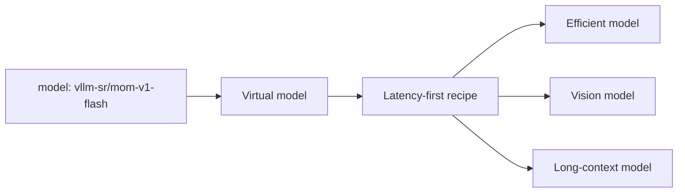

# Mixture of Models

A **Mixture of Models (MoM)** is a serving architecture in which several
independently deployed models act as one system. A routing policy decides which
model, cascade, panel, or workflow should handle each request.

The client does not need to know which physical backend won. It asks for a
stable virtual model that represents the desired behavior.



## MoM is not Mixture of Experts

Mixture of Experts (MoE) is a model architecture: a gating mechanism activates
parts of one checkpoint during inference. Mixture of Models is a serving-system
architecture: independently trained and independently served models are chosen
or coordinated at request time.

MoM can combine dense models, MoE models, hosted APIs, and local models. Their
internal architecture does not change the routing abstraction.

## Three kinds of model in the system

| Kind | Example | Role |
| --- | --- | --- |
| **Provider model** | A vLLM, Ollama, or hosted model endpoint | Generates the application response. |
| **Virtual model** | `vllm-sr/mom-v1-flash` | Gives clients a stable objective and selects a recipe. |
| **Router system model** | An embedding or classifier asset | Helps detect intent, risk, similarity, or another routing signal. |

Router system models support the decision process; they are not themselves the
Mixture of Models product exposed to clients.

## Execution patterns

### Select one model

Most requests should take a direct path. Policy narrows the eligible set and an
algorithm selects one backend by semantic fit, latency, relative cost, feedback,
or a fixed order.

### Cascade

Start with an efficient model, inspect a bounded confidence or verification
signal, and escalate only when needed. Cascades trade extra worst-case latency
for lower average cost.

### Orchestrate several models

Parallel comparison, multi-round reasoning, and workflows can use several
models before producing one response. These paths are valuable for selected
high-accuracy tasks, not as a default for all traffic.

## Virtual models and recipes

An entrypoint maps one or more public model names to an isolated recipe:

```yaml
entrypoints:
  - model_names: ["acme/assistant-fast"]
    recipe: fast

recipes:
  - name: fast
    routing:
      strategy: priority
      decisions:
        - name: default-fast-route
          description: Route eligible requests through the fast model pool.
          priority: 10
          rules:
            operator: AND
            conditions: []
          modelRefs:
            - model: local/small
              use_reasoning: false
            - model: local/vision
              use_reasoning: false
          algorithm:
            type: static
```

Signals and decisions identify the task. Candidate requirements then check the
capabilities and context capacity of the assigned models. Deployment placement
and data handling remain operator responsibilities. The public model name
resolves to the selected provider model before backend dispatch.

See [Virtual Models](../tutorials/global/entrypoints-and-recipes)
for the full schema and isolation rules.

## MoM V1

MoM V1 offers five built-in recipes. Connect your own backends and choose the
policy that fits your application:

| Public model | Recipe | Decisions |
| --- | --- | --- |
| `vllm-sr/mom-v1-blend` | **Balance**: everyday quality, latency, and cost | `simple`, `medium`, `reasoning` |
| `vllm-sr/mom-v1-lite` | **Cost**: economical serving with targeted escalation | `economy`, `tools`, `reasoning` |
| `vllm-sr/mom-v1-flash` | **Speed**: responsive conversation and streaming | `fast`, `tools`, `reasoning` |
| `vllm-sr/mom-v1-ultra` | **Accuracy**: strong answers and explicit orchestration | `simple`, `reasoning`, `review`, `agent` |
| `vllm-sr/mom-v1-vault` | **Vault**: processing within your private deployment | `private`, `sensitive`, `guard` |

Balance combines task difficulty, consequential advice, and answer-recovery
signals. Speed and Cost use lighter routing signals. Accuracy normally selects
one strong model; independent review and workflows require explicit intent.
Long input or a subject label alone does not cause multi-model execution.

Vault disables client tools and Router content storage on every path. Its
`guard` decision contains prompt attacks immediately. Safety and Hazard select
`sensitive` for content risks, where an approved model can provide responsible
help, explain risky material, or refuse harmful assistance. Hazard uses the
model's published category thresholds.
Assign Vault's other decisions to backends that meet your privacy requirements;
the recipe cannot establish their physical location or provider retention.

Start or resume the stack:

```bash
vllm-sr serve
```

Open **Models** in the Dashboard to connect and verify inference endpoints.
Choose a **Recipe**, assign models to its backend decisions, and publish a
**Mixture-of-Model** entrypoint. Single-model decisions need at least one
qualified model; Accuracy's `review` and `agent` need two distinct workers.
Vault's `guard` needs no backend assignment.

Declare capabilities and input/output limits, and supply the relevant quality
index at the assigned reasoning effort. **Preview** shows the signals, decision,
and candidate-selection result. Send a real request to verify execution and
latency before rollout.

Policy version 3.0 keeps the decision names above and sends content risks to the sensitive pool. Validate new assignments before
publishing an upgrade; existing published versions remain unchanged. See the
[MoM V1 Model Card](https://github.com/vllm-project/semantic-router/blob/main/config/recipes/built-in/latest/mom-v1/README.md)
for the complete requirements and data-handling policy.

## When MoM is the wrong abstraction

Use a direct model endpoint when one backend satisfies the workload and policy
is unlikely to change. A multi-model system adds configuration, evaluation,
observability, and operational cost. Its value should come from a clear
capability boundary, objective, or measured routing improvement.

## Next

- [Models, Entrypoints, and Serving](../tutorials/global/models-entrypoints-serving)
  for the complete CLI and backend-binding workflow.
- [Use Cases](use-cases) for practical patterns.
- [Routing Pipeline](signal-driven-decisions) for policy composition.
- [Algorithms](../tutorials/algorithm/overview) for selection and orchestration
  choices.
