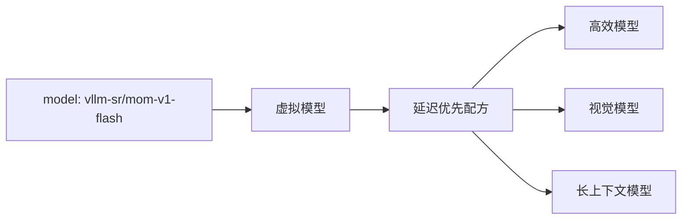

# 多模型混合

**Mixture of Models（MoM）** 是一种服务架构：若干独立部署的模型作为一个系统工作。路由策略决定由哪个模型、级联、评审组或工作流处理每次请求。

客户端不必知道哪个物理后端胜出。它请求的是代表期望行为的稳定虚拟模型。



## MoM 不是 Mixture of Experts

Mixture of Experts（MoE）是模型架构：门控机制在推理时激活同一检查点的部分参数。Mixture of Models 是服务系统架构：独立训练、独立服务的模型在请求时被选择或协调。

MoM 可以组合稠密模型、MoE 模型、托管 API 和本地模型。它们的内部架构不改变路由抽象。

## 系统中的三类模型

| 种类 | 示例 | 角色 |
| --- | --- | --- |
| **提供方模型** | vLLM、Ollama 或托管模型端点 | 生成应用响应。 |
| **虚拟模型** | `vllm-sr/mom-v1-flash` | 为客户端给出稳定目标，并选择配方。 |
| **Router 系统模型** | 嵌入或分类器资产 | 帮助检测意图、风险、相似度或其他路由信号。 |

Router 系统模型支撑决策过程；它们本身不是面向客户端的 Mixture of Models 产品。

## 执行模式

### 选择一个模型

大多数请求应走直达路径。策略缩小合格集合，算法再按语义匹配、延迟、相对成本、反馈或固定顺序选出一个后端。

### 级联

先用高效模型，检查有界的置信度或校验信号，只在需要时升级。级联用更高的最坏延迟换更低的平均成本。

### 编排多个模型

并行比较、多轮推理和工作流可以在产出一条响应前使用多个模型。这些路径适合选定的高精度任务，不应作为全部流量的默认行为。

## 虚拟模型与配方

入口把一个或多个公开模型名映射到隔离的配方：

```yaml
entrypoints:
  - model_names: ["acme/assistant-fast"]
    recipe: fast

recipes:
  - name: fast
    routing:
      strategy: priority
      decisions:
        - name: default-fast-route
          description: Route eligible requests through the fast model pool.
          priority: 10
          rules:
            operator: AND
            conditions: []
          modelRefs:
            - model: local/small
              use_reasoning: false
            - model: local/vision
              use_reasoning: false
          algorithm:
            type: static
```

信号与决策识别任务，候选条件再检查已分配模型的能力和上下文容量。部署位置与数据处理边界由运维人员负责。请求发往后端前，公开模型名会解析为选中的提供方模型。

完整 schema 和隔离规则见[虚拟模型](../tutorials/global/entrypoints-and-recipes)。

## MoM V1

MoM V1 提供五个内置配方。连接自己的后端，再选择适合应用的策略：

| 公开模型 | 配方 | 决策 |
| --- | --- | --- |
| `vllm-sr/mom-v1-blend` | **Balance**：兼顾日常质量、延迟和成本 | `simple`、`medium`、`reasoning` |
| `vllm-sr/mom-v1-lite` | **Cost**：经济处理，按需升级 | `economy`、`tools`、`reasoning` |
| `vllm-sr/mom-v1-flash` | **Speed**：快速对话和流式输出 | `fast`、`tools`、`reasoning` |
| `vllm-sr/mom-v1-ultra` | **Accuracy**：高质量回答和显式编排 | `simple`、`reasoning`、`review`、`agent` |
| `vllm-sr/mom-v1-vault` | **Vault**：在指定的私有部署中处理请求 | `private`、`sensitive`、`guard` |

Balance 综合任务难度、重要建议和回答纠错信号。Speed 与 Cost 使用更轻量的路由信号。Accuracy 通常选择一个强模型；独立评审和工作流需要明确的执行意图。长输入或领域标签本身不会触发多模型执行。

Vault 的每条路径都禁用客户端工具和 Router 内容存储。`guard` 会直接拦截检测到的提示攻击。Safety 和 Hazard 将内容风险交给 `sensitive` 的高质量私有模型池，让后端可以提供安全的支持、分析或必要的拒绝；PII 和保密信息也使用这个池。其他请求走 `private`。这些路径需要分配满足隐私要求的后端；配方无法保证后端的物理位置或提供方的数据保留行为。

启动或恢复服务：

```bash
vllm-sr serve
```

在 Dashboard 的 **Models** 中连接并验证推理端点。选择 **Recipe**，为调用后端的决策分配模型，再发布 **Mixture-of-Model** 入口。单模型决策至少需要一个合格模型；Accuracy 的 `review` 和 `agent` 需要两个不同的工作模型。Vault 的 `guard` 无需后端分配。

声明模型能力、输入输出限制，并为实际配置的推理强度提供对应质量指标。**Preview** 展示信号、决策和候选选择结果；上线前再发送真实请求，验证执行结果与延迟。

策略版本 3.0 保留上表的决策名称，并将内容风险交给敏感请求模型池。升级前先验证新分配，再发布；已发布的旧版本保持不变。完整要求和数据处理策略见 [MoM V1 Model Card](https://github.com/vllm-project/semantic-router/blob/main/config/recipes/built-in/latest/mom-v1/README.md)。

## 何时 MoM 不是合适的抽象

当一个后端就能满足工作负载，且策略不太可能变化时，请直接使用模型端点。多模型系统会增加配置、评估、可观测性和运维成本。它的价值应来自清晰的能力边界、目标，或可度量的路由改进。

## 下一步

- [模型、入口与服务](../tutorials/global/models-entrypoints-serving)：完整的 CLI 与后端绑定工作流。
- [使用场景](use-cases)：实用模式。
- [路由流水线](signal-driven-decisions)：策略如何组合。
- [算法](../tutorials/algorithm/overview)：选择与编排选项。
